# Layer 2 Switch VLAN Configuration Lab

## Overview

This lab demonstrates the configuration of VLANs, access ports, and 802.1Q trunking on Cisco 2960 switches using Cisco Packet Tracer.

The goal was to segment devices into separate VLANs, allow devices in the same VLAN to communicate across multiple switches, and verify that devices in different VLANs remain isolated without inter-VLAN routing.

## Lab Objectives

- Build a Layer 2 network in Cisco Packet Tracer
- Configure IPv4 addresses on end devices
- Create VLAN 20 and VLAN 30
- Configure switch access ports
- Configure an 802.1Q trunk between switches
- Verify VLAN and trunk configurations
- Test connectivity using ICMP ping
- Confirm VLAN isolation
- Use Cisco Discovery Protocol (CDP) to identify neighboring devices and switch ports

## Network Topology

The network consists of:

- 2 Cisco 2960 switches
- 4 PCs
- VLAN 20
- VLAN 30
- 1 trunk link between the switches

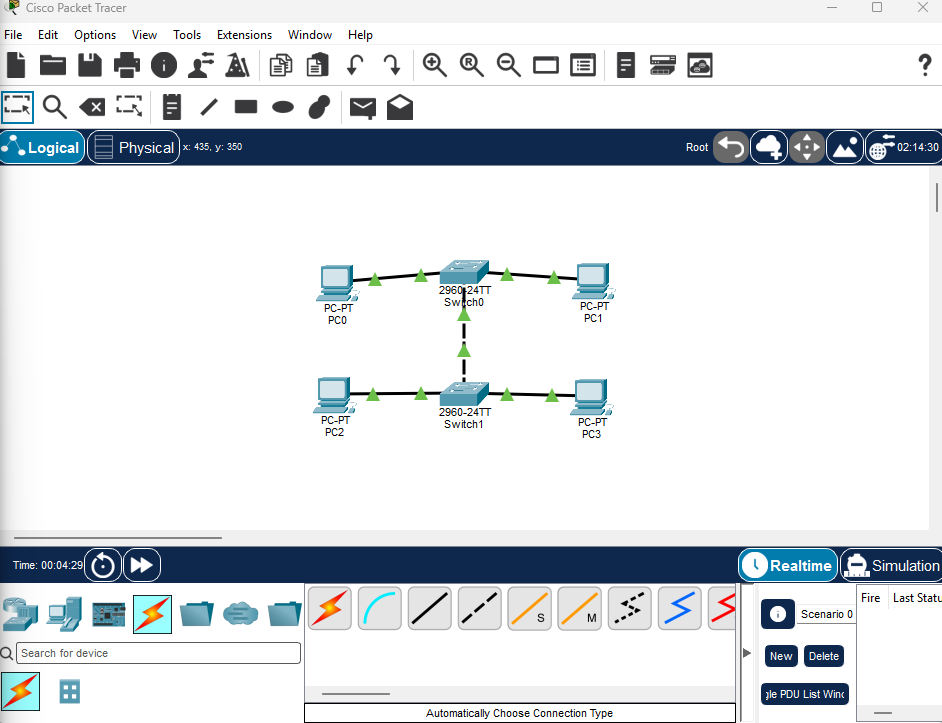

## IP Addressing

| Device | IP Address | Subnet Mask | VLAN |
|---|---|---|---|
| PC0 | 172.16.20.2 | 255.255.255.0 | 20 |
| PC1 | 172.16.30.2 | 255.255.255.0 | 30 |
| PC2 | 172.16.20.3 | 255.255.255.0 | 20 |
| PC3 | 172.16.30.3 | 255.255.255.0 | 30 |

No default gateway was configured because this lab focuses on Layer 2 switching and does not use a router for inter-VLAN routing.

## Baseline Connectivity Test

Before configuring VLANs, I tested connectivity between PC0 and PC2.

```text
ping 172.16.20.3
```

The ping was successful with 0% packet loss.

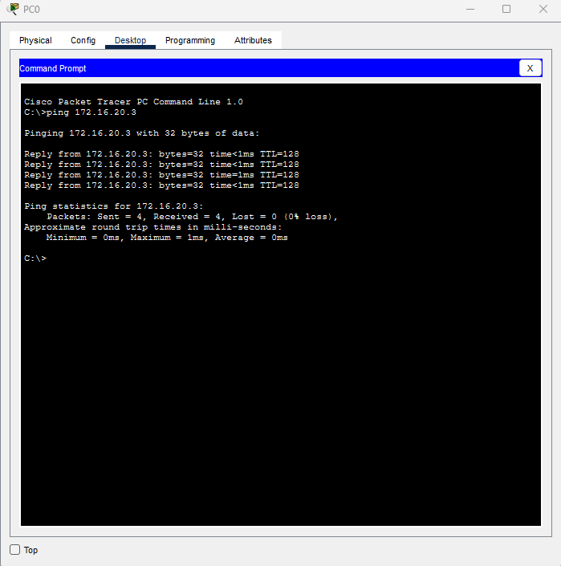

## Default VLAN Configuration

I used the following command to view the default VLAN configuration:

```text
show vlan brief
```

All switch ports initially belonged to VLAN 1.

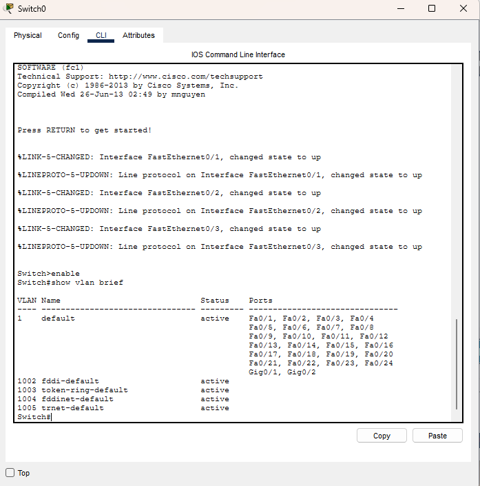

## Creating VLANs

I created VLAN 20 and VLAN 30 on both switches.

```text
configure terminal
vlan 20
vlan 30
end
```

I verified the VLANs using:

```text
show vlan brief
```

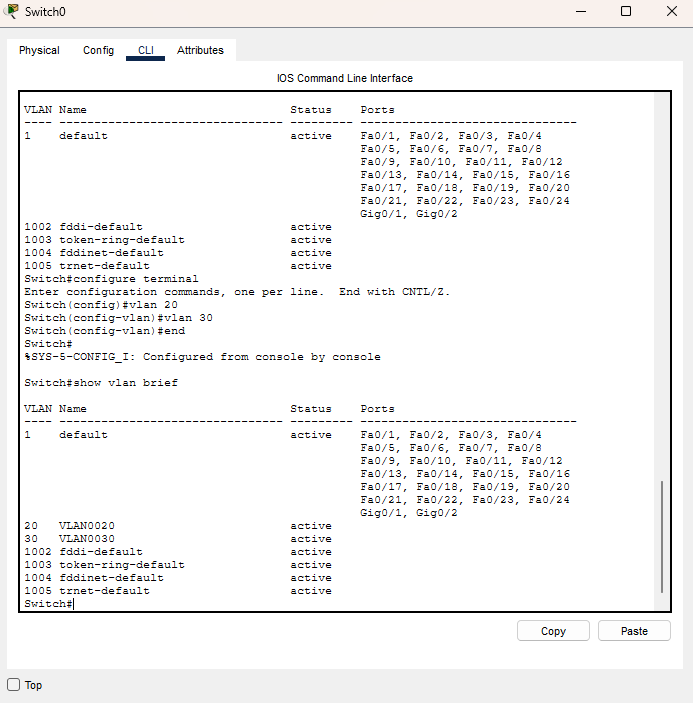

## Identifying the Switch-to-Switch Link

Before configuring switch ports, I used Cisco Discovery Protocol to identify the port connecting the two switches.

```text
show cdp neighbors
```

The switch-to-switch connection was identified as:

```text
FastEthernet0/3
```

Using CDP helped avoid accidentally assigning the trunk port to an access VLAN.

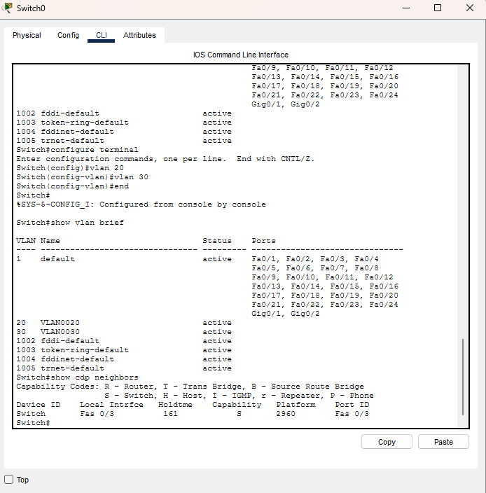

## Configuring Access Ports

### Switch0

PC0 was assigned to VLAN 20:

```text
configure terminal
interface fa0/1
switchport mode access
switchport access vlan 20
```

PC1 was assigned to VLAN 30:

```text
interface fa0/2
switchport mode access
switchport access vlan 30
end
```

The configuration was verified with:

```text
show vlan brief
```

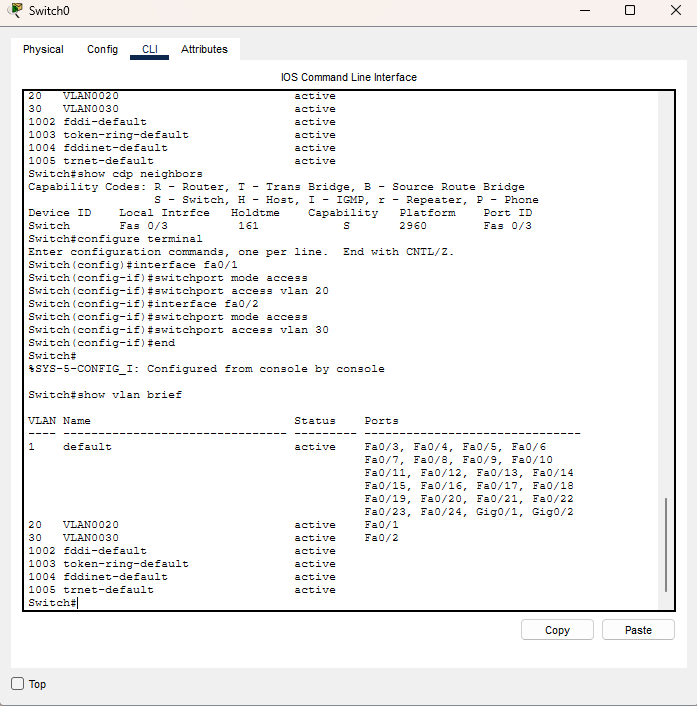

### Switch1

PC2 was assigned to VLAN 20:

```text
configure terminal
interface fa0/1
switchport mode access
switchport access vlan 20
```

PC3 was assigned to VLAN 30:

```text
interface fa0/2
switchport mode access
switchport access vlan 30
end
```

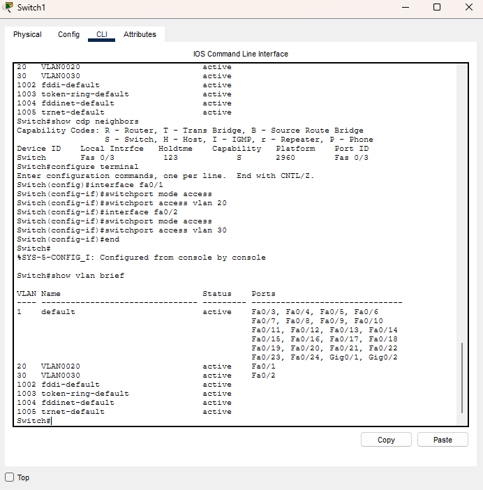

## Configuring the Trunk

FastEthernet0/3 connects the two switches.

The port was configured as an 802.1Q trunk on both switches:

```text
configure terminal
interface fa0/3
switchport mode trunk
end
```

The trunk was verified using:

```text
show interfaces trunk
```

The output confirmed that VLANs 20 and 30 were active and allowed across the trunk.

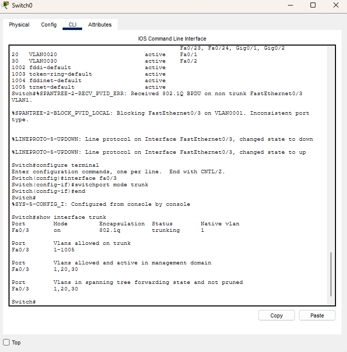

## VLAN 20 Connectivity Test

PC0 successfully communicated with PC2 across the trunk.

```text
ping 172.16.20.3
```

Result:

```text
0% packet loss
```

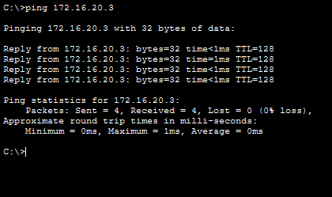

## VLAN 30 Connectivity Test

PC1 successfully communicated with PC3 across the trunk.

```text
ping 172.16.30.3
```

Result:

```text
0% packet loss
```

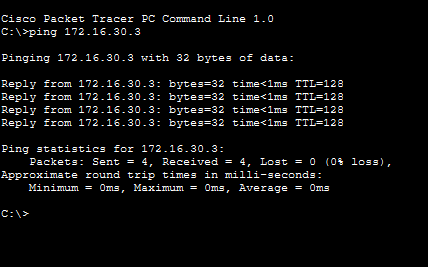

## Switchport Verification

I verified that FastEthernet0/1 was operating as an access port assigned to VLAN 20.

```text
show interfaces fa0/1 switchport
```

Important output included:

```text
Administrative Mode: static access
Operational Mode: static access
Access Mode VLAN: 20
```

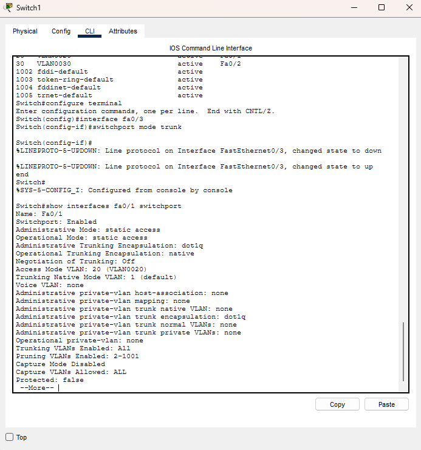

## Testing VLAN Isolation

I tested communication from a device in VLAN 20 to a device in VLAN 30.

From PC0:

```text
ping 172.16.30.2
```

The ping failed with 100% packet loss.

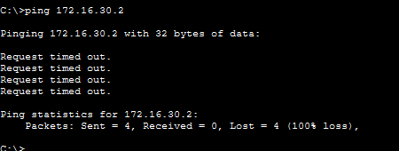

This result was expected because VLAN 20 and VLAN 30 are separate Layer 2 broadcast domains.

A router or Layer 3 switch would be required to provide inter-VLAN routing between them.

## Key Concepts Learned

- Layer 2 switching
- VLAN configuration
- VLAN segmentation
- Access port configuration
- 802.1Q trunking
- Cisco IOS CLI
- Cisco Discovery Protocol
- Switchport verification
- IPv4 addressing
- Subnet masks
- ICMP ping testing
- Network connectivity testing
- Network isolation
- Inter-VLAN routing concepts
- Basic network troubleshooting
- Technical documentation

## Commands Used

```text
enable
configure terminal
vlan 20
vlan 30
interface fa0/1
interface fa0/2
interface fa0/3
switchport mode access
switchport access vlan 20
switchport access vlan 30
switchport mode trunk
show vlan brief
show cdp neighbors
show interfaces trunk
show interfaces fa0/1 switchport
show interfaces fa0/2 switchport
ping
```

## Key Takeaway

Devices in the same VLAN can communicate across multiple switches when an 802.1Q trunk carries that VLAN between the switches.

Devices in different VLANs remain isolated unless a Layer 3 device is configured to route traffic between them.

## Tools Used

- Cisco Packet Tracer
- Cisco 2960 switches
- Cisco IOS CLI

## Lab Source

101 Labs CompTIA Security+ - Configuring a Layer 2 Switch

https://www.101labs.net/comptia-security/configuring-a-layer-2-switch/
